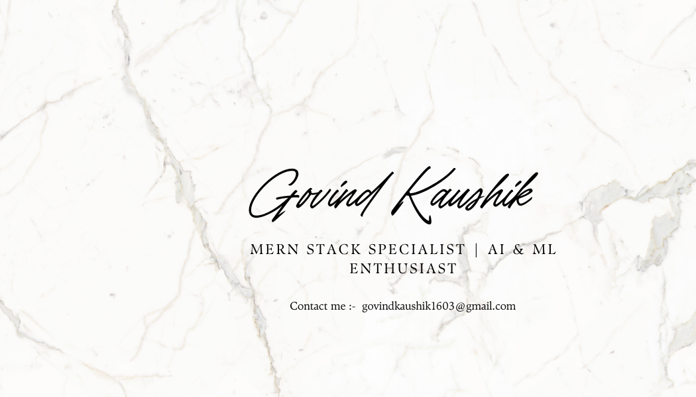

<h2 align="left">Hi 👋! My name is Govind  : 🌐 MERN Apps: Scalable MongoDB, Express, React, Node.js. ⚡ Optimized Code: Fast, modular Next.js & REST API apps.</h2>

###

  
  

###

  
  
  
  
  
  
  
  
  
  
  
  
  
  
  
  
  
  
  
  
  
  
  
  
  
  
  

###

  
  
  
  

###

 

<picture>
    <source media="(prefers-color-scheme: dark)" srcset="https://github.com/kaushikji-23/Kaushikji-23/blob/output/github-snake-dark.svg">
    <source media="(prefers-color-scheme: light)" srcset="https://github.com/kaushikji-23/Kaushikji-23/blob/output/github-snake.svg">
    
</picture>
###